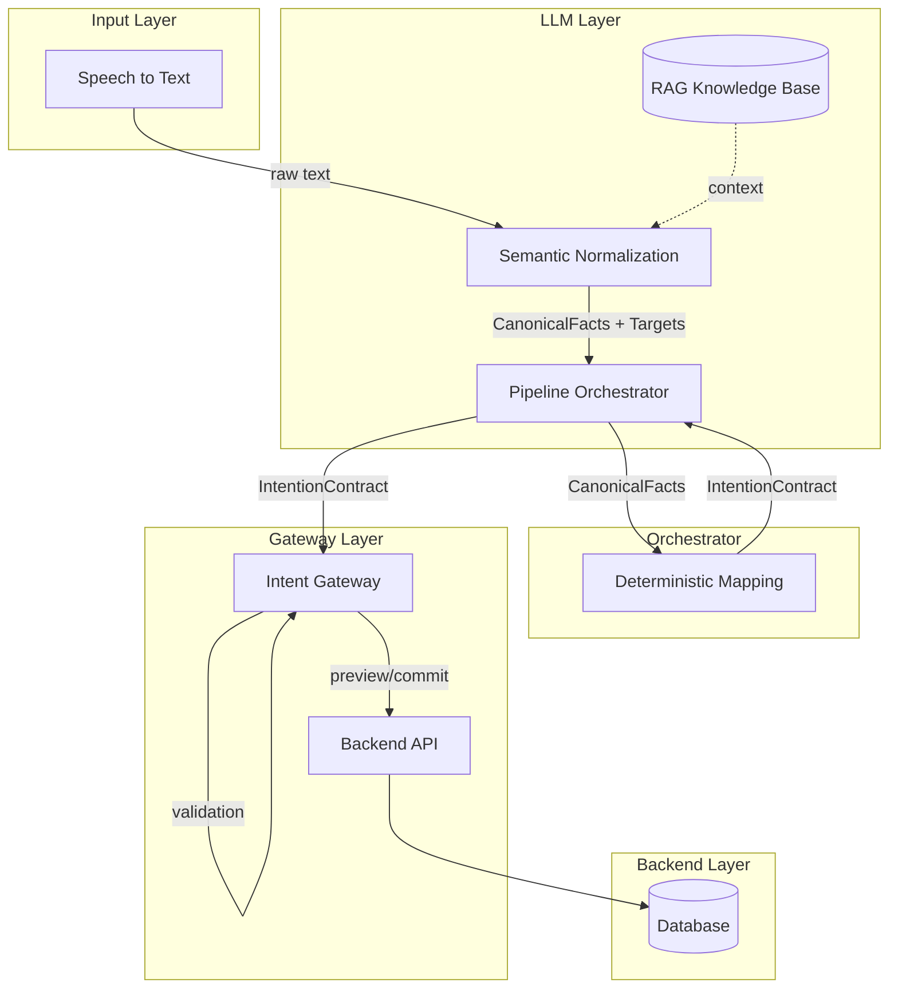
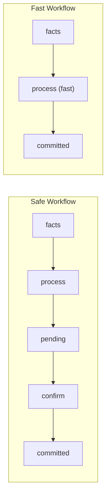
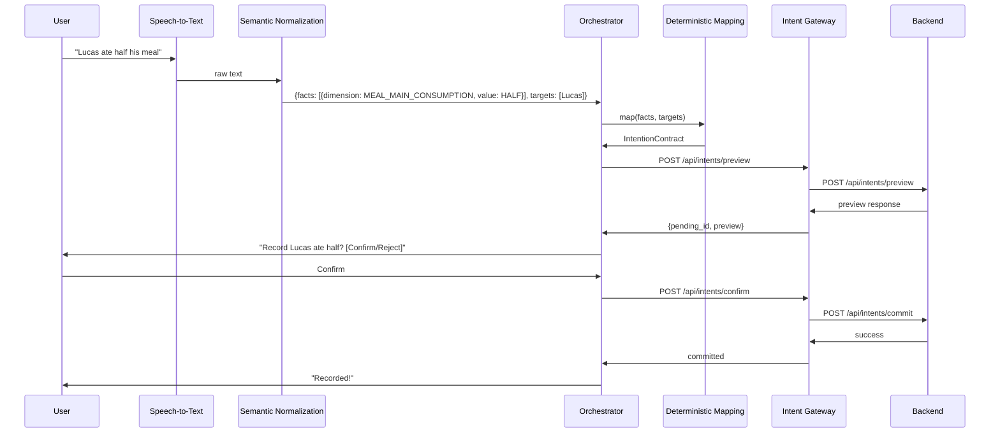

# Speech-to-Act Architecture with Intent Contract

## 1. Goal

The goal is to transform natural user utterances into **deterministic database actions**, maximizing LLM stability for various equivalent formulations.

---

## 2. Global Architecture



### Service Ports

| Service | Port | Description |
|---------|------|-------------|
| Backend Mock | 3001 | Mock REST API (no persistence) |
| Intent Gateway | 3002 | Validates contracts, manages pending intents |
| Orchestrator | 3003 | Chains mapping → gateway |

---

## 3. Component Breakdown

### 3.1 Speech to Text

- Transforms audio → raw text
- Output: free text

### 3.2 Semantic Normalization Layer

- **Responsibility:** Transform free text → canonical semantic facts
- **Technology:** LLM in CLASSIFICATION mode (not generation)
- **Output Example:**

```json
{
  "facts": [
    {
      "dimension": "MEAL_MAIN_CONSUMPTION",
      "value": "HALF",
      "confidence": 0.82
    }
  ],
  "targets": ["Gabriel"]
}
```

**RAG Integration:**
- Injects lexicons, domain terminology, few-shot examples
- Stabilizes LLM output for equivalent phrasings
- Dynamic rules without model retraining

### 3.3 Deterministic Mapping Layer

- **Responsibility:** Transform canonical facts → valid IntentionContract
- **Technology:** Pure TypeScript code (NO AI/LLM)
- **Zero probabilistic behavior**

**Why not let LLM generate the contract directly?**

1. **Stability:** Classification is a multiple-choice task (~99% reliable). JSON generation risks hallucination.
2. **M-to-1 Mapping:** Many phrasings → one contract. Code handles this better than prompts.
3. **Firewall:** LLM cannot invent actions. Only mapped facts produce contracts.

```typescript
if (fact.dimension === "MEAL_MAIN_CONSUMPTION") {
  return {
    domain: "MEAL",
    type: "MEAL_CONSUMPTION",
    attributes: { main: fact.value }
  };
}
```

### 3.4 Pipeline Orchestrator

- **Responsibility:** Chain the full pipeline
- **Technology:** REST API (Express)
- **Endpoints:**

| Endpoint | Description |
|----------|-------------|
| `POST /api/process` | Process facts through mapping → gateway |
| `POST /api/process/confirm` | Confirm a pending intent |
| `POST /api/process/reject` | Reject a pending intent |

**Workflow Options:**



### 3.5 Intent Gateway

- **Responsibility:** Validate contracts, manage pending intents, call backend
- **Technology:** REST API (Express)
- **Endpoints:**

| Endpoint | Description |
|----------|-------------|
| `POST /api/intents/preview` | Validate and store as pending |
| `GET /api/intents/pending` | List pending intents |
| `POST /api/intents/confirm` | Confirm pending intent |
| `POST /api/intents/reject` | Reject pending intent |
| `POST /api/intents/commit` | Direct commit (trusted) |

**Pending Intent Flow:**
- Intents stored in memory (5-minute TTL)
- User must confirm before commit
- Auto-expire if not confirmed

### 3.6 Backend API

- Data persistence
- Auditability
- Final business validation
- Completely independent of LLM

---

## 4. Data Flow Example



---

## 5. Role of RAG

- Provide lexicons, examples, rules to assist normalization
- Never directly produces the final contract
- Stabilizes LLM classification

---

## 6. Key Points for Invariance

1. Canonical classification before contract generation
2. Deterministic mapping to intent contract
3. Gateway validation to ensure consistency
4. Backend as the ultimate guardian of integrity

---

## 7. Expected Reliability

| Approach | Reliability |
|----------|-------------|
| Direct LLM → Backend | ~85-90% |
| LLM + Contract validation | ~90-95% |
| Classification + Mapping + Gateway | 95-99% |
| + User confirmation | 99%+ |

> **Note:** The LLM alone is never 100% deterministic.
> Invariance comes from the stack: classification → mapping → gateway → backend.
